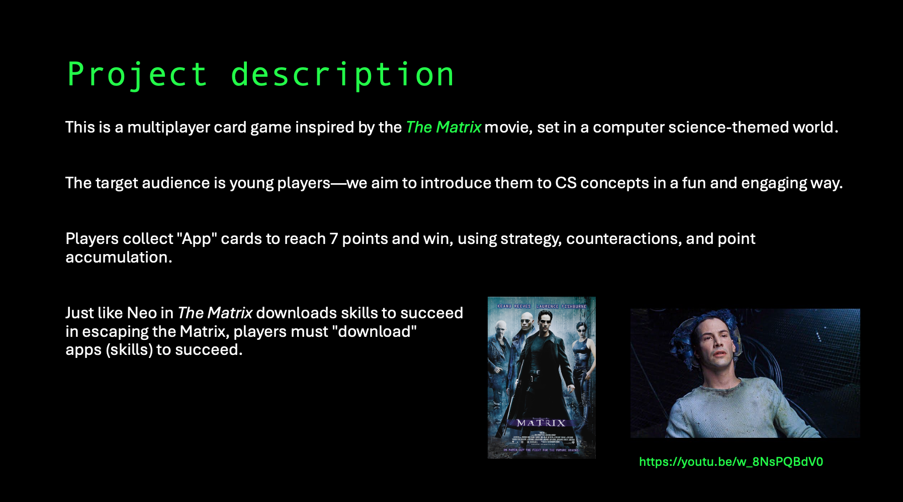
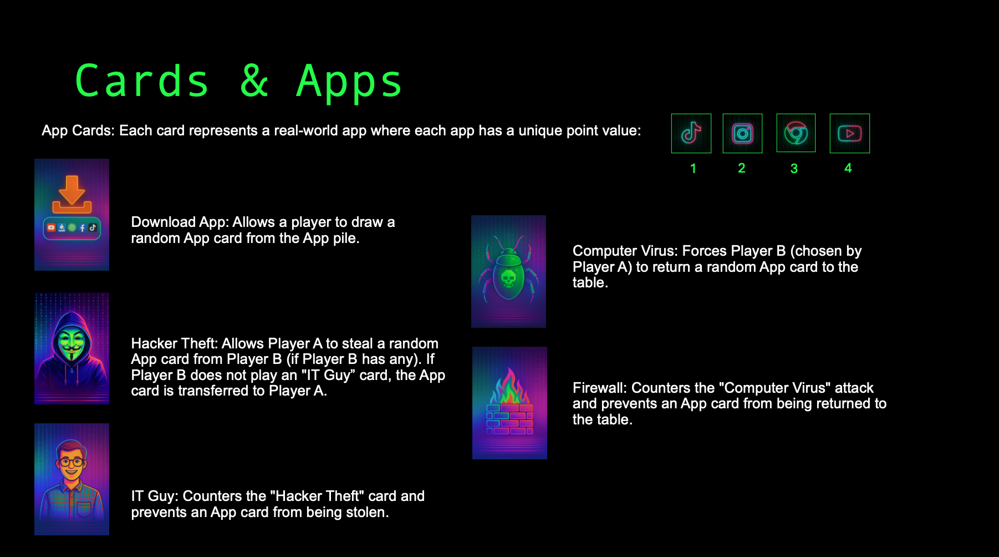
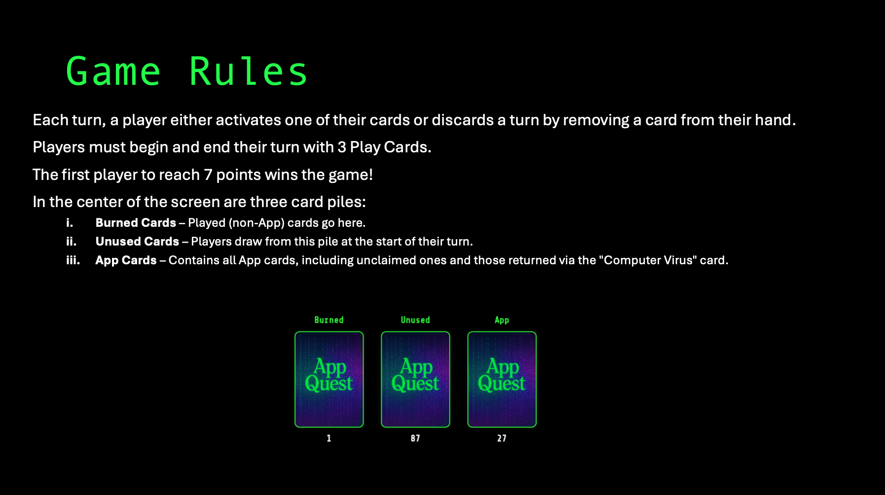

# 🎮 App Quest - Multiplayer Card Game

## 🎯 Game Concept

**App Quest** is a multiplayer card game where players compete to collect cards known as "Apps," aiming to accumulate 7 points to win. The game features strategic card usage, counteractions, and point accumulation mechanics, all set in a Matrix-themed world with a black and neon green aesthetic.

  

---

## 🎲 Game Setup

The center of the screen displays three types of card piles arranged side by side:

1. **Burned Cards**: Previously played cards (excluding App cards) are moved to this pile.
2. **Unused Cards**: The draw pile from which players automatically draw cards at the beginning of their turn.
3. **App Cards**: Contains all App cards, including unclaimed ones and those returned via "Computer Virus" attacks.

## 🃏 Types of Cards

  

### 📱 App Cards

Each card represents a real-world application (e.g., YouTube, Instagram, TikTok, Google Chrome) with unique point values ranging from 1-4 points.

### ⚔️ Special Action Cards

- **Hacker Theft**: Allows the player to steal a random App card from a targeted opponent. The target can defend using an "IT Guy" card, otherwise the App card is transferred to the attacking player.

- **IT Guy**: Defensive card that counters "Hacker Theft" attacks, preventing App cards from being stolen.

- **Computer Virus**: Forces a targeted opponent to return a random App card to the App pile. Can be countered with a "Firewall" card.

- **Firewall**: Defensive card that counters "Computer Virus" attacks, preventing App cards from being returned.

### 🔽 Utility Cards

- **Download App**: Allows the player to draw a random App card from the App pile.

## 📊 Card Distribution

### App Deck (28 cards total):

- 10 App cards worth 1 point each
- 8 App cards worth 2 points each
- 6 App cards worth 3 points each
- 4 App cards worth 4 points each

### Unused Deck (100 cards total):

- 20 Hacker Theft cards
- 15 IT Guy cards
- 20 Computer Virus cards
- 15 Firewall cards
- 30 Download App cards

## 📖 Gameplay Rules

  

### 🔄 Turn Structure

- Each player maintains exactly three non-App cards in their hand at the start and end of their turn
- At the beginning of each turn, a player automatically draws one card from the unused pile
- Players may then choose to play one action card or discard a card to end their turn

### 🎯 Action Cards

Players can play the following cards during their turn:

- **Download App**
- **Computer Virus** (requires target selection)
- **Hacker Theft** (requires target selection)

When playing Computer Virus or Hacker Theft, a popup window appears allowing the player to select which opponent to target. The popup includes a "Cancel" button to abort the action.

### 🗑️ Discarding Cards

If a player cannot or chooses not to play an action card, they must discard one card to the burned pile. Players can access this option via a "Pass Turn & Discard Card" button. After clicking this button, they select which card to discard, ending their turn.

### ⚔️ Attack and Defense System

When a player uses Computer Virus or Hacker Theft on an opponent:

1. The targeted player sees a popup: "_[PlayerName] used [CardType] on you!_"
2. If the targeted player has the appropriate counter card:
   - **Defend** button: Uses their counter card
   - **Submit** button: Accepts the attack
3. If no counter card is available, only the **Submit** button is enabled
4. Both the attack card and defense card (if used) are moved to the burned pile
5. The targeted player draws one card from the unused pile to maintain three cards in hand

### 🔄 Turn Progression

Turns proceed clockwise to the next player after the current player completes their action.

### 🏆 Victory Condition

The game ends immediately when any player accumulates 7 points from collected App cards. A popup window displays the winner's name with a "Return to Lobby" button.

---

## 🚀 Quick Start

1. **Clone the repository**
2. **Install dependencies**: `flutter pub get` (frontend) and `npm install` (backend)
3. **Configure Firebase**: Set up your Firebase project
4. **Run the app**: `flutter run -d web`

For detailed setup instructions, see the [User Guide](guides/USER_GUIDE.md) and [Developer Guide](guides/DEVELOPER_GUIDE.md).

---

  
<strong>Ready to hack the Matrix? 🕶️</strong>

  
Experience the ultimate card game in a cyber world!

